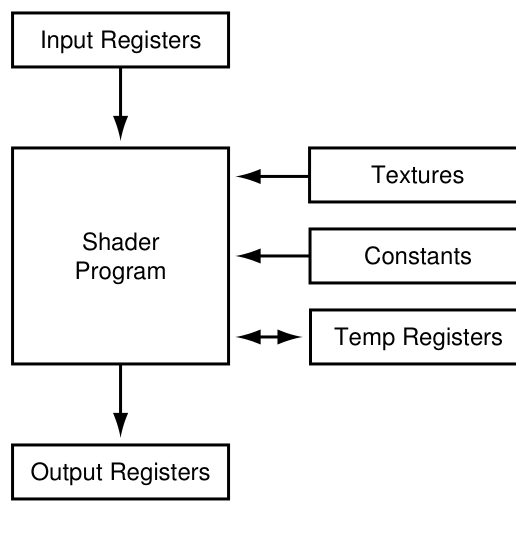
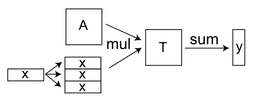
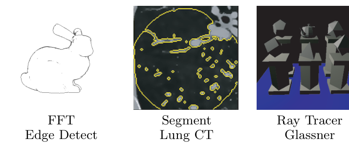
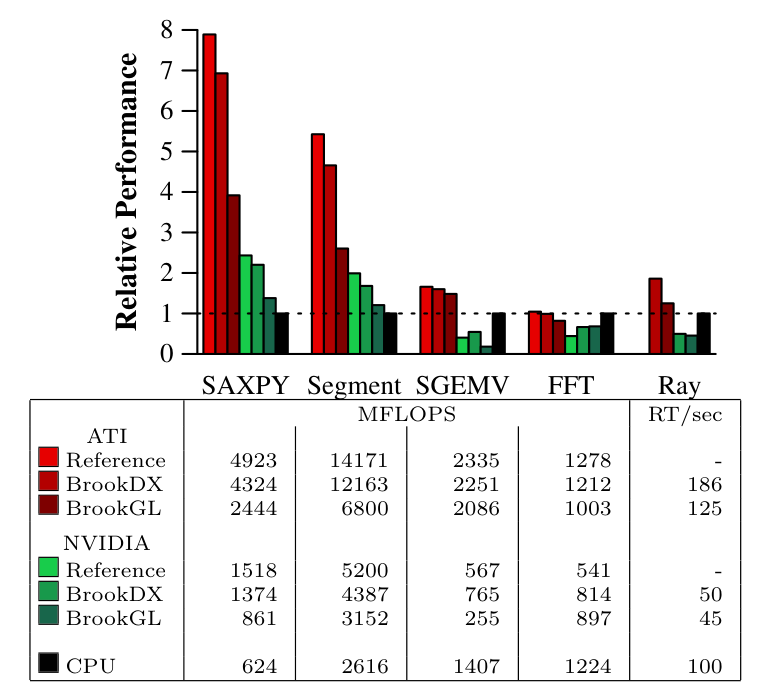
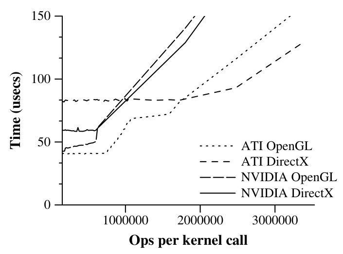

# Brook 精读笔记

- 论文：Brook for GPUs: Stream Computing on Graphics Hardware. Ian Buck, Tim Foley, Daniel Horn, Jeremy Sugerman, Kayvon Fatahalian, Mike Houston, Pat Hanrahan. Stanford University. SIGGRAPH 2004 / ACM Transactions on Graphics 23(3):777–786（2004；会议与页码是稿外信息，对照稿页眉只写了斯坦福大学）.
- 对照文本：本目录下 `01_Brook_for_GPUs_2004.md`（英中段落对齐版）。下文引用先列英文原文、再列中文译文，括号内的行号（英 / 中）均指该文件。
- 阅读顺序：问题 → 人和当时的条件 → 影响 → 方法 → 证据。

**一句话：把 GPU 收成流、核函数和归约三种语言结构，再用编译器补上纹理尺寸、输出个数和结构体；五个应用里 Brook 接近手写 GPU 代码，最快比 CPU 快约七倍，但这只在计算密度够高、每次核函数的工作量够大时成立。**

---

## 1. 问题

### 1.1 着色器已经能算渲染以外的东西

2004 年的商用图形硬件已经从固定功能流水线变成可编程的顶点处理器和片元处理器。可编程性是为实时着色加的，指令集却已经够做渲染以外的计算。线性代数、物理模拟、完整的光线追踪器都有人在 GPU 上跑过（L46 / L49）。

缺的不是「GPU 能不能算」，是程序员怎样把算法交到这块硬件上。

> However, these languages do not assist the programmer in controlling other aspects of the graphics pipeline, such as allocating texture memory, loading shader programs, or constructing graphics primitives. As a result, the implementation of applications requires extensive knowledge of the latest graphics APIs as well as an understanding of the features and limitations of modern hardware. In addition, the user is forced to express their algorithm in terms of graphics primitives, such as textures and triangles. As a result, general-purpose GPU computing is limited to only the most advanced graphics developers.
>
> 然而，这些语言并不帮助程序员控制图形流水线的其他方面，例如分配纹理内存、加载着色器程序或构造图形图元。因此，实现应用需要对最新图形 API 的大量知识，以及对现代硬件特性与限制的理解。此外，用户被迫用纹理、三角形等图形图元来表达自己的算法。结果是，通用 GPU 计算仅限于最资深的图形开发者。（L53 / L56）

HLSL、Cg、GLslang 解决的是着色器里那一段类 C 代码。分配纹理、加载程序、构造图元仍要程序员自己写图形 API。算法必须被说成纹理和三角形。

### 1.2 计算被写成一串对着色图元的操作

Purcell 等人已经把 GPU 看成流处理器：核函数写成片元或顶点着色器，数据放在几何体和纹理里。语言有了，调用方式还是图形的。

> However, even with these languages, applications must still execute explicit graphics API calls to organize data into streams and invoke kernels. For example, stream management is performed by the programmer, requiring data to be manually packed into textures and transferred to and from the hardware. Kernel invocation requires the loading and binding of shader programs and the rendering of geometry. As a result, computation is not expressed as a set of kernels acting upon streams, but rather as a sequence of shading operations on graphics primitives.
>
> 然而，即便有了这些语言，应用仍然必须显式调用图形 API 来把数据组织成流并调用核函数。例如，流的管理由程序员完成，需要手动把数据打包进纹理并在硬件之间来回传输；调用核函数则需要加载并绑定着色器程序，再渲染几何体。结果是，计算并没有被表达为作用于流之上的一组核函数，而是被表达为对图形图元的一系列着色操作。（L156 / L159）



图 1：当时可编程硬件的执行模型。着色器只看见一个顶点或片元：只读输入寄存器、常量、纹理、临时寄存器，结果写入输出寄存器。Brook 要藏起来的就是这张图。

### 1.3 流处理器和向量处理器差在临时值放哪

SIMD 和向量算子的一步是：读、执行一条指令、把结果写回片外存储器。带宽就耗在这些来回上。

> Today's graphics hardware executes small programs where instructions load and store data to local temporary registers rather than to memory. This is a major difference between the vector and stream processor abstraction [Khailany et al. 2001].
>
> 而今天的图形硬件执行的是小程序，其中的指令把数据加载到本地临时寄存器并从中存储，而不是直接读写内存。这是向量处理器抽象与流处理器抽象之间的一个主要区别 [Khailany et al. 2001]。（L105 / L108）

流把这个差别写成语言。流是一组要做相似计算的记录，核函数是施加到每个元素上的函数。流处理器对输入流的全部元素跑一遍核函数，结果放进输出流。

> Dally et al. [2003] explain how stream programming encourages the creation of applications with high arithmetic intensity, the ratio of arithmetic operations to memory bandwidth. This paper defines a similar property called computational intensity to compare CPU and GPU performance.
>
> Dally 等人 [2003] 解释了流编程如何鼓励构建具有高算术密度（arithmetic intensity，即算术运算与内存带宽之比）的应用。本文定义了一个类似的性质，称为计算密度（computational intensity），用于比较 CPU 与 GPU 的性能。（L112 / L115）

两个词以后要分开用。算术密度是核函数内部「每读一个字做多少浮点运算」。计算密度是「在设备上把算法跑完的时间」相对「把数据传进传出设备的时间」。第 5.2 节才给出后者的式子。GPU 和宿主 CPU 通常不在同一地址空间，所以后一个比才决定这块卡值不值得用。

### 1.4 硬件限制原样露在语言外面

> For example, stream elements are limited to natively-supported float, float2, float3, and float4 types, rather than allowing more complex user-defined structures. In addition, programmers must always be aware of hardware limitations such as shader instruction count, number of shader outputs, and texture sizes.
>
> 例如，流元素仅限于硬件原生支持的 float、float2、float3 和 float4 类型，而不允许更复杂的用户自定义结构体。此外，程序员必须时刻留意诸如着色器指令数、着色器输出数量和纹理尺寸等硬件限制。（L163 / L166）

同期的缓解都只盖住一部分。Chan 等人能把过长的着色器自动拆开，躲开指令数和输入个数，但没有处理多个着色器输出。McCool 等人的 Sh 用 C++ 元编程定义着色器，主要是着色系统，也能做别的计算，却没有通用计算里的 gather 和归约。

本文把贡献收成三件：流编程模型（流、核函数、归约）；用编译器和运行时虚拟化内存系统、着色器输出个数、用户自定义结构；以及一个比较 GPU 与 CPU 的代价模型（L67 / L70，L74 / L77，L81 / L84）。

---

## 2. 人和当时的条件

### 2.1 语言先写给流式机器，再适配到这块 GPU

> Ian Buck, Tim Foley, Daniel Horn, Jeremy Sugerman, Kayvon Fatahalian, Mike Houston, Pat Hanrahan — Stanford University
>
> Ian Buck、Tim Foley、Daniel Horn、Jeremy Sugerman、Kayvon Fatahalian、Mike Houston、Pat Hanrahan —— 斯坦福大学（L5 / L8）

> Brook was developed as a language for streaming processors such as Stanford's Merrimac streaming supercomputer [Dally et al. 2003], the Imagine processor [Kapasi et al. 2002], the UT Austin TRIPS processor [Sankaralingam et al. 2003], and the MIT Raw processor [Taylor et al. 2002]. We have adapted Brook to the capabilities of graphics hardware, and will only discuss Brook in the context of GPU architectures in this paper.
>
> Brook 最初是作为面向流处理器的语言而开发的，这些处理器包括斯坦福的 Merrimac 流式超级计算机 [Dally et al. 2003]、Imagine 处理器 [Kapasi et al. 2002]、UT Austin 的 TRIPS 处理器 [Sankaralingam et al. 2003] 以及 MIT 的 Raw 处理器 [Taylor et al. 2002]。我们已把 Brook 适配到图形硬件的能力上，本文只在 GPU 架构的语境下讨论 Brook。（L180 / L183）

语言的设计目标写在第 3 节开头：用流表达数据并行，用核函数提高算术密度；语言里不出现图形结构，以便映射到多种流式架构。实现已经有 NVIDIA 与 ATI、DirectX 与 OpenGL，外加一个 CPU 参考实现。

致谢里的资助把这条线说清楚了。Brook 的 GPU 实现由 DARPA 资助，ATI、IBM、NVIDIA、SONY 另有支持。语言本身来自能源部 NNSA 的 ASCI Alliances、DARPA Smart Memories 和 DARPA Polymorphous Computing Architectures。语言设计上列名的有 Bill Dally 以及 NASA、Reservoir Labs 的人。光线追踪的 Brook 实现由 Tim Purcell 提供。

稿外：斯坦福项目页写本文 “To appear at SIGGRAPH 2004”；ACM 记录为 Transactions on Graphics 第 23 卷第 3 期，2004 年 8 月，第 777–786 页，DOI 10.1145/1015706.1015800。ACM 页面有时把 Tim Foley 写成 Theresa Foley，对照稿作者行是 Tim Foley。Buck 的博士论文就是这项工作，导师是 Pat Hanrahan；Hanrahan 与 Catmull 后来获得 2019 年图灵奖，奖项针对计算机图形，不是针对这篇 GPU 计算论文。

### 2.2 前人：从帧缓冲到 Imagine

相关工作分成硬件抽象和编程环境两支。

可编程图形硬件可以追到 England 1986 的可编程帧缓冲。UNC 的 PixelPlanes 系列把作为 SIMD 运行的像素处理器和帧缓冲做在同一芯片上，顶点是 PixelFlow。Peercy 等人把 OpenGL 的每一个渲染 pass 看成一条 SIMD 指令，并据此把 RenderMan 编译到带 imaging 扩展的 OpenGL 1.2。Thompson 等人在图形库上加了一层软件，把 GPU 当成对浮点数组做运算的向量处理器。

流式机器那边，Imagine 证明流计算对图形和图像一类媒体应用有效，StreamC/KernelC 把应用映射到 Imagine。Labonte 等人 2004 年把一台流式虚拟机映射到图形硬件上测性能。本文写：这里的编程模型可以很容易地编译到他们的虚拟机上。这是划界，不是实验：本文没有报告那次编译。

### 2.3 2004 年的卡和对照用的 CPU

测试平台写在第 5 节开头。GPU 是两块：ATI Radeon X800 XT Platinum，驱动 4.4；预发布的 NVIDIA GeForce 6800，驱动 60.80，脚注写核心 350MHz、显存 500MHz。两边都是 Windows XP，Brook 各跑 OpenGL 和 DirectX。CPU 除非另有说明，是 3 GHz Intel Pentium 4，Intel 875P 芯片组，Windows XP。

第 2.2 节给的是同一代卡的编程界面：ATI X800XT 和 GeForce 6800 的顶点与片元处理器跑用户指定的汇编着色器，指令是 4 路 SIMD，包括 3 或 4 分量点积、纹理读取和少量专用指令。

论文没有报告功耗、价格、双精度吞吐。SAXPY 的双精度版本被提到是 LINPACK Top500 的核心内核，实验本身用的是单精度 SAXPY 和 SGEMV。

---

## 3. 影响

### 3.1 论文自报的成绩是「接近手写，最快七倍」

摘要把成绩说成两句：Brook 实现与手写 GPU 代码相当，并且比对应的 CPU 实现最快可达七倍（L22 / L25）。正文把「最快」落到两个应用上，同时写出最差的那个。

> The Brook DirectX ATI versions of SAXPY and Segment performed roughly 7 and 4.7 times faster than the equivalent CPU implementations. SAXPY illustrates that even a kernel executing only a single MAD instruction is able to out-perform the CPU due to the additional internal bandwidth available on the GPU. FFT was our poorest performing application relative to the CPU. The Brook implementation is only .99 the speed of the CPU version. FFTW blocks the memory accesses to make very efficient use of the processor cache. (Without this optimization, the effective CPU MFLOPS drops from 1224 to 204.)
>
> SAXPY 和 Segment 的 Brook DirectX ATI 版本分别比等价的 CPU 实现快约 7 倍和 4.7 倍。SAXPY 说明，即使是只执行一条 MAD 指令的核函数，也能凭借 GPU 上额外的内部带宽胜过 CPU。相对于 CPU，FFT 是我们表现最差的应用：Brook 实现的速度只有 CPU 版本的 .99 倍。FFTW 对内存访问做了分块，以极其高效地利用处理器缓存（没有这项优化时，CPU 的有效 MFLOPS 会从 1224 降到 204）。（L765 / L768）

七倍不是五个应用的平均。它是 ATI、DirectX、SAXPY 相对那台 Pentium 4 的大约数。FFT 在有缓存分块的 FFTW 面前只到 0.99 倍；拿掉分块，CPU 从 1224 MFLOPS 掉到 204，Brook 才能显得追平。读第 5 节的表时，NVIDIA 上的 SGEMV 和光线追踪还低于 CPU 那一行。正文用 “perform well” 概括，表把分项留着。

和手写 GPU 代码比，DirectX 后端是另一句：

> DirectX is within 80% of the performance of the hand-coded GPU implementations. The OpenGL backend however is much less efficient compared to the reference implementations. This was largely due to the need to copy the output data from the OpenGL pbuffer into a texture (refer to 4.2).
>
> DirectX 达到了手写 GPU 实现 80% 以上的性能。而 OpenGL 后端与参考实现相比效率则低得多，这主要是由于需要把输出数据从 OpenGL 的 pbuffer 复制到纹理中（参见 4.2 节）。（L772 / L775）

这 80% 是相对各应用自己的手写版本，而手写版本的 API 并不统一：SAXPY 的参考实现是手工优化的 DirectX，SGEMV 是优化过的 OpenGL，Segment 是手写 OpenGL，FFT 是 ATI 提供的定制 OpenGL。光线追踪一列没有 GPU 参考实现。OpenGL 慢，作者主要归因于 Pbuffer 拷回纹理；SGEMV 要做多 pass 归约，这次拷贝更显眼。手写代码用应用相关的知识避开了它。

### 3.2 作者对「何时该用 GPU」的判断

图 3 的数字不含把数据传上 GPU、再传回来的时间。作者接着写：传输开销会改变某个算法上 GPU 是否胜过 CPU。第 5.2 节把这个条件收成计算密度和加速比，第 6 节再收成两句话。

> Our analysis shows that there are two key application properties necessary for effective utilization of the GPU. First, in order to outperform the CPU, the amount of work performed must overcome the transfer costs which is a function of the computational intensity of the algorithm and the speedup of the hardware. Second, the amount of work done per kernel call should be large enough to hide the setup cost required to issue the kernel. We anticipate that while the specific numbers may vary with newer hardware, the computational intensity, speedup, and kernel overhead will continue to dictate effective GPU utilization.
>
> 我们的分析表明，要有效利用 GPU，应用需要具备两个关键性质。第一，为了胜过 CPU，所执行的工作量必须能抵消传输开销，而这取决于算法的计算密度和硬件的加速比。第二，每次核函数调用完成的工作量应足够大，以掩盖发出核函数所需的设置开销。我们预计，尽管具体数字会随更新的硬件而变化，计算密度、加速比和核函数开销仍将继续决定 GPU 的有效利用。（L883 / L886）

「具体数字会变，三个因素还在」是作者对通用性的判断。支撑它的是第 5 节的五个应用加上一个合成核函数，不是一份跨领域的测量。

### 3.3 论文结尾把 GPU 写成 PC 的计算引擎

> Brook for GPUs has been released as an open-source project [Brook 2004] and our hope is that this effort will make it easier for application developers to capture the performance benefits of stream computing on the GPU for the graphics community and beyond. By providing easy access to the computational power within consumer graphics hardware, stream computing has the potential to redefine the GPU as not just a rendering engine, but the principle compute engine for the PC.
>
> Brook for GPUs 已作为开源项目发布 [Brook 2004]，我们希望这项工作能让图形社区内外的应用开发者更容易地获得 GPU 上流计算的性能收益。通过让人们轻松获取消费级图形硬件中的计算能力，流计算有潜力重新定义 GPU：它不再只是渲染引擎，而是 PC 的主要计算引擎。（L914 / L917）

英文用的是 principle。这是预期，不是本文的测量结论。本文量到的是五个内核相对一台 Pentium 4 和两块 2004 年图形卡的吞吐。

### 3.4 稿外：语言停在 2007 年前后，编程模型进了 CUDA

稿外，和论文原文分开。

- 引用量随索引不同。检索日 2026-09-29：ACM Digital Library 页面约 539 次，Rankless 记 891 次，另一聚合页记约 1161 次。这里不取单一数字。
- Kayvon Fatahalian 在自己的斯坦福页面上写：Brook 是 NVIDIA CUDA 的学术前身。Buck 本人在 Tom's Hardware 访谈里说，他 2005 年加入 NVIDIA 启动 CUDA，当时是他和另一名工程师；NVIDIA 博客则写他 2004 年完成博士后入职。两处年份不完全一致。
- Buck 在 GTC 2009 的讲稿 “From Brook to CUDA” 里列出 Brook 受图形约束的地方：图形 API、纹理尺寸与维度、着色器输出个数、整数与位运算、像素之间不能 scatter。这些条目和第 6 节作者自己列出的限制是同一张单子。
- 维基百科 BrookGPU 条目：主要测试版 v0.4 在 2004 年 10 月，v0.5 beta 1 在 2007 年 11 月，之后停止。许可证是 BSD，部分代码 GPL。开源发布本身是论文里的话；停止开发是稿外。
- 本合集里从 `02_AlexNet_2012` 起的训练，用的是这条线上后来的 GPU 编程栈。AlexNet 没有使用 Brook。本文也没有神经网络实验。

---

## 4. 方法

### 4.1 流是有名字、有类型、有形状的记录集合

> A stream is a collection of data which can be operated on in parallel. Streams are declared with angle-bracket syntax similar to arrays, i.e. `float s<10,5>` which denotes a 2-dimensional stream of floats. Each stream is made up of elements. In this example, `s` is a stream consisting of 50 elements of type float. The shape of the stream refers to its dimensionality. In this example, `s` is a stream of shape 10 by 5. Streams are similar to C arrays, however, access to stream data is restricted to kernels (described below) and the `streamRead` and `streamWrite` operators, that transfer data between memory and streams.
>
> 流是可以被并行处理的数据集合。流用类似数组的尖括号语法声明，例如 `float s<10,5>` 表示一个二维的 float 流。每个流由元素组成；在这个例子中，`s` 是一个由 50 个 float 类型元素组成的流。流的形状（shape）指的是它的维度；在这个例子中，`s` 是形状为 10×5 的流。流类似于 C 数组，但对流数据的访问仅限于核函数（见下文）以及在内存与流之间传输数据的 `streamRead` 和 `streamWrite` 算子。（L243 / L246）

元素类型可以是 float、Cg 的 float2 / float3 / float4，以及由这些原生类型组成的结构体。光线可以写成带原点、方向和 `tmax` 的 `Ray`，再声明 `Ray r<100>`。用户自定义内存类型在当时的图形 API 里没有，Brook 同时给了编译期类型检查（L268 / L271）。

形状对不上时，Brook 按输出流的形状改输入：每个维度上可以重复（123 变成 111222333）或跨步（123456789 变成 13579）（L344 / L347）。矩阵向量乘的例子用的就是这个重复。

### 4.2 核函数是隐式循环，参数分成四类

`kernel` 关键字声明的函数作用在流上。调用一次，就是对每个元素跑一遍函数体。SAXPY 写成：

```c
kernel void saxpy (float a, float4 x<>, float4 y<>,
                   out float4 result<>) {
  result = a*x + y;
}
```

宿主侧的顺序是 `streamRead` 把数组拷进流，调用 `saxpy`，再 `streamWrite` 拷回。标量 `a` 是只读常量。

参数四类：

| 种类 | 写法 | 约束 |
| --- | --- | --- |
| 输入流 | `float4 x<>` | 只读，按规则模式访问，每个元素只用一次 |
| 输出流 | `out` | 个数不限（L323 / L326） |
| 聚集流 | C 数组 `array[]` | 只读，任意下标，元素可以重用 |
| 非流参数 | 普通 C 参数 | 只读常量 |

为了能数据并行，核函数不能写静态变量或全局变量。同一个流可以同时当输入和输出（原地计算），前提是它在这个核函数里没有再被当成聚集流（L351 / L354）。

Brook 强迫程序员把「按顺序送进来的输入流」和「用下标聚集的流」写成两种参数。输入流的访问是规则的，而且不重用；聚集流可以随机读、可以重用。Purcell 等人已经指出，当时的图形硬件不区分这两种访问，输入流数据会污染给聚集用的缓存（L393 / L396）。语言先把区别记下来，硬件还没有对应的两套存储器。

核函数和向量算子的差别在这里落到算术密度上：

> Kernels perform arbitrary function evaluation whereas vector operators consist of simple math operations. Vector operations always require temporaries to be read and written to a large vector register file. In contrast, kernels capture additional locality by storing temporaries in local register storage. By reducing bandwidth to main memory, arithmetic intensity is increased since only the final result of the kernel computation is written back to memory.
>
> 核函数可以执行任意函数求值，而向量算子只由简单的数学运算组成。向量运算总是要求把临时值读写到一个大的向量寄存器文件；相反，核函数把临时值存放在本地寄存器中，从而捕获了额外的局部性。由于只有核函数计算的最终结果才写回内存，对主存带宽的需求减少，算术密度随之提高。（L400 / L403）

第 3.4 节还列了本文不再展开的特性：`indexof` 取当前元素位置；迭代器流提供预先填好的序列；分组、取子区域、跨步、重复、环绕等高级流算子，在不支持核函数内聚集的平台上靠迭代器和聚集实现。ScatterOp 和 GatherOp 是并行的间接读—改—写，用来建流里的数据结构。

> However, due to GPU hardware limitations, we currently perform these operations on the CPU.
>
> 然而，由于 GPU 硬件的限制，目前我们在 CPU 上执行这些操作。（L505 / L508）

### 4.3 归约只要求结合律

核函数把一个函数施加到一组数据上。归约从一组记录算出一个值，例子是求和、求最大值、矩阵乘积。

> In order to perform the reduction in parallel, we require the reduction operation to be associative: $(a \circ b) \circ c = a \circ (b \circ c)$. This allows the system to evaluate the reduction in whichever order is best suited for the underlying architecture.
>
> 为了并行地执行归约，我们要求归约操作满足结合律：$(a \circ b) \circ c = a \circ (b \circ c)$。这允许系统按最适合底层架构的任意顺序来计算归约。（L414 / L417）

论文要求的是结合律，没有写交换律。输出用 `reduce` 标出，计算两个值的归约时这个参数可读可写。输出若是单个元素，就得到整条流的归约；若仍是流，则按输入与输出的形状决定多少个相邻元素合成一个输出（L421 / L424）。

$y = Ax$ 被拆成一次核函数和一次归约：

```c
kernel void mul (float a<>, float b<>, out float c<>) {
  c = a * b;
}
reduce void sum (float a<>, reduce float r<>) {
  r += a;
}
```

`A` 是 `<50,50>`，`x` 是 `<1,50>`，乘积 `T` 是 `<50,50>`，`y` 是 `<50,1>`。先 `mul(A,x,T)`，再 `sum(T,y)`。



图中 `x` 在第一维上比 `T` 小，于是沿这一维重复，铺成和 `T` 一样大的矩阵；`T` 和 `y` 的第二维长度不同，`sum` 就按行归约（L463 / L466）。

### 4.4 编译器把核函数变成片元着色器

系统两块：brcc 是源到源编译器，基于开源 C 解析器 cTool，改过以识别 Brook 原语；BRT 是运行时库。brcc 把核函数映射成 Cg，厂商的着色器编译器再翻成 GPU 汇编，并生成用 BRT 调用核函数的 C++（L515 / L518）。

BRT 对每个后端提供同一接口。三个后端是 OpenGL、DirectX 和 CPU 参考实现。作者列出三个好处：用户按硬件选后端；可以比较两种图形 API 做计算的性能；可以吃 API 特有的功能，例如 OpenGL 的 0 到 n 纹理寻址，以及 DirectX 的直接渲染到纹理（L522 / L525）。

映射规则：

- 流是浮点纹理。`streamRead` / `streamWrite` 是上传和下载。聚集是依赖纹理读取。重复和跨步是纹理采样。
- 图形 API 只有 float 到 float4 四种纹理格式。结构体的每个成员放进一张不同的纹理（L543 / L546）。
- 核函数跑在片元处理器上。流参数从纹理初始化，聚集换成纹理读取，非流参数走常量寄存器（L597 / L600）。
- 执行时 BRT 发一个四边形，片元个数等于输出流元素个数，结果渲染到当前渲染目标。DirectX 直接渲染进输出纹理。OpenGL 没有轻量的「纹理当渲染目标」，Pbuffer 切换又贵（Bolz 等人 2003），所以 OpenGL 后端渲染到一张浮点 Pbuffer，再拷进输出纹理。拟议中的 Superbuffer（Percy 2003）被写成可能缓解这一点（L604 / L607）。

附录 A 把 SAXPY 的编译结果展开了。Cg 里两次 `__fetch_float4`，函数体仍是 `result = alpha * x + y`。最终的 fp30 汇编是两次 `TEX` 加一条 `MADR o[COLR], alpha.x, R0, R1`。这就是「一条 MAD 也能赢 CPU」在编译结果里的样子。DirectX 汇编和 CPU 实现文中没有列出。

BRT 还允许把 Brook 流绑成图形 API 的原生纹理，在普通图形程序里画出来。因此流的默认布局是固定的：纹理维度等于流的形状。

### 4.5 虚拟化：纹理形状、浮点精度、输出个数

浮点纹理最多二维。NVIDIA 最大 4096×4096，ATI 最大 2048×2048。形状直接对应的话，就不能有三维以上的流，一维流也不能超过 2048 或 4096 个元素（L557 / L560）。

brcc 的一个编译选项把流按行环绕进一张纹理，只要元素总数放得进这一张。访问时插入地址转换：用点积把最多四维的流下标线性化，再拆成纹理坐标。元素个数可以达到一张最大二维纹理的纹素数（L564 / L567）。

精度另有上限：

> If the unscaled index exceeds the largest representable sequential integer in the graphics card's floating-point format (16,777,216 for NVIDIA's s23e8 format, 131,072 for ATI's 24-bit s16e7 format) then there is not sufficient precision to uniquely address the correct stream element. For example, our implementation effectively increases the maximum 1D stream size for a portable Brook program from 2048 to 131072 elements on ATI hardware. Ultimately, these limitations in texture addressing point to the need for a more general memory addressing model in future GPUs.
>
> 如果未缩放的索引超过了显卡浮点格式所能表示的最大连续整数（NVIDIA 的 s23e8 格式为 16,777,216，ATI 的 24 位 s16e7 格式为 131,072），就没有足够的精度来唯一地寻址正确的流元素。例如，在 ATI 硬件上，我们的实现实际上把可移植 Brook 程序的一维流最大尺寸从 2048 提高到了 131072 个元素。归根结底，纹理寻址的这些限制表明未来的 GPU 需要一个更通用的内存寻址模型。（L583 / L586）

输出个数是另一处虚拟化。硬件着色器输出不够，或者输出流是结构体时，brcc 把核函数拆成多个 pass。每个 pass 是核函数的一份完整副本，只把一部分输出接到着色器输出上，再靠着色器编译器的死代码消除删掉这一 pass 用不到的计算（L627 / L630）。

效果取决于各输出之间共享多少计算。表 1 是 NVIDIA DirectX 后端上的测量。Slowdown 是单输出实现相对多输出实现的性能下降。

| 程序 | 纹理指令 | 算术指令 | MFLOPS | 减速 |
| --- | --- | --- | --- | --- |
| Mat4Mult4 | 8 | 16 | 3611 | |
| Mat4Mult1 | 20 | 16 | 1683 | 53% |
| Cloth4 | 6 | 54 | 5086 | |
| Cloth1 | 12 | 102 | 2666 | 47% |

Mat4Mult 把两个 4×4 矩阵流相乘，输出 4 个 float4。4 输出硬件一个 pass 做完；单输出硬件为每个输出各做一个着色器。每一行可以独立算，所以算术指令都是 16；纹理指令从 8 增到 20，因为每个 pass 都要重新读入其中一个矩阵的 16 个元素。Cloth 更新粒子的位置和速度，两者共享一次力的计算。拆开之后这份计算要做两遍，算术指令从 54 到 102，纹理指令从 6 到 12。作者的结论是：系统用得上多输出硬件，也能在只有单输出时照常跑（L641 / L644）。

### 4.6 归约没有硬件指令

> Current graphics hardware does not have native support for reductions. BRT implements reduction via a multipass method similar to Krüger and Westermann [2003]. The reduction is performed in $O(\log n)$ passes, where $n$ is the ratio of the sizes of the input and output streams. For each pass, the reduce operation reads up to 8 adjacent stream elements, and outputs their reduced values. Since each pass produces between 2 and 8 fewer values, Brook reductions are a linear-time computation.
>
> 当前的图形硬件没有对归约的原生支持。BRT 用一种类似于 Krüger 和 Westermann [2003] 的多 pass 方法来实现归约。归约在 $O(\log n)$ 个 pass 中完成，其中 $n$ 是输入流与输出流大小之比。每个 pass 中，归约操作最多读取 8 个相邻的流元素，并输出它们归约后的值。由于每个 pass 产生的值比上一轮少 2 到 8 倍，Brook 的归约是线性时间的计算。（L664 / L667）

每个 pass 的具体规模还取决于流的大小和归约核函数。时间是线性的，因为 pass 数是对数、每轮把元素数降下来。英文 “between 2 and 8 fewer values” 和中文「少 2 到 8 倍」用词不完全对齐；机制以同一段里的另外两句为准：每轮最多读 8 个相邻元素，pass 数是 $O(\log n)$。

作者还写了一种硬件上没有的做法：若有一个能跨片元累加的持久寄存器，归约可以在一个 pass 里完成。他们用一个核函数模拟：读一个元素，加到常量上，再 `fragment kill` 阻止写回。这是模拟，不是那块硬件的实测。数字放在第 5.4 节。

### 4.7 代价模型：传输必须被计算盖住

许多 Brook 程序的骨架是 `streamRead`、一串核函数、`streamWrite`。CPU 做同样的计算不需要这两次传输（L807 / L810）。

考虑把 $n$ 条记录送到 GPU、对每条执行核函数、再读回。峰值时执行时间和传输量都按元素数线性：

$$T_{gpu} = n(T_r + K_{gpu}) \qquad T_{cpu} = n K_{cpu}$$

$T_r$ 是一条记录下载再读回的时间，$K_{gpu}$ 和 $K_{cpu}$ 是一条记录上的核函数时间。GPU 更快，当且仅当

$$T_r < K_{cpu} - K_{gpu}$$

也就是 GPU 上少花的计算时间必须盖住传输（L840 / L843）。令加速比 $s \equiv K_{cpu}/K_{gpu}$，计算密度 $\gamma \equiv K_{gpu}/T_r$，代入后是

$$\gamma > \frac{1}{s-1}$$

$s$ 越大，或者 $\gamma$ 越大，越适合放上 GPU（L847 / L850）。

> Computational intensity differs in that it considers the entire cost of executing an algorithm on a device versus the cost of transferring the data set to and from the device. Computational intensity is quite relevant to the GPU which generally does not operate in the same address space as the host processor.
>
> 计算密度的不同之处在于，它考虑的是在设备上执行整个算法的全部开销与把数据集传入传出设备的开销之比。计算密度对 GPU 相当重要，因为 GPU 通常并不与宿主处理器工作在同一地址空间。（L869 / L872）

模型假设 $K_{gpu}$ 和 $T_r$ 与 $n$ 无关。短流上这个假设不成立，证据是图 4，放在下一节。

---

## 5. 证据

实验顺序：五个应用先比吞吐，明确不含传输；再用模型把传输加回去；最后用合成核函数看发一次核函数的固定开销。

### 5.1 五个应用，对照实现各不相同

选择标准有三条：它们代表数值计算里不同的算法类型；图形学和科学计算都常用；已经有优化过的 CPU 或 GPU 实现可以比（L702 / L705）。

| 应用 | 问题规模 | Brook 里怎么做 | CPU 对照 | GPU 对照 |
| --- | --- | --- | --- | --- |
| SAXPY | 向量长度 $1024^2$，$y=ax+y$ | 一条 MAD | Intel MKL | 手工优化的 DirectX |
| SGEMV | 矩阵 $1024^2$，$y=\alpha Ax+\beta y$ | 乘加与归约 | ATLAS | 优化过的 OpenGL |
| Segment | 2048×2048，Perona–Malik 二维区域生长 | 每迭代 32 次浮点运算，读 10 个 float，写 2 个 | 按 Pentium 4 缓存调过的实现 | 手写 OpenGL |
| FFT | 4 通道 1024×1024 复信号，Cooley–Tukey | 水平、垂直 1D FFT 各调 10 次，位反转 1 次；每个输出 5 次浮点运算 | FFTW-3，Intel C++ 编译 | ATI 的定制 OpenGL；另提 Moreland 与 Angel 2003 |
| Ray | Purcell 等人 2002 的简化版 | 三个核函数：光线设置、三角形求交、着色 | Wald 2004 的手工汇编，3.0GHz Pentium 4 上最多每秒 1 亿条光线 | 表中没有 |

FFT 的总浮点运算次数按 benchFFT 写成 $5 \cdot w \cdot h \cdot \text{channels} \cdot \log_2(w \cdot h)$。Segment 的算法形式来自 Sherbondy 等人 2003。光线求交核函数在第 3.2 节，它同时读输入流和用下标聚集三角形。



图 2：FFT 做出的边缘、肺 CT 上的分割、Glassner 场景的光线追踪。图只说明这三个程序产出了图像，不包含计时。

### 5.2 图 3 的吞吐不含拷贝



> In all of these results, we do not include the streamRead and streamWrite costs.
>
> 所有这些结果都不包括 streamRead 和 streamWrite 的开销。（L758 / L761）

柱状图按 CPU 归一化，虚线是 1。表中前四列是有效 MFLOPS，按源代码里写出的浮点运算数计算。Ray 一列的表头是 RT/sec，正文说报告的是每秒光线—三角形测试次数。

| | SAXPY | Segment | SGEMV | FFT | Ray |
| --- | --- | --- | --- | --- | --- |
| ATI Reference | 4923 | 14171 | 2335 | 1278 | - |
| ATI BrookDX | 4324 | 12163 | 2251 | 1212 | 186 |
| ATI BrookGL | 2444 | 6800 | 2086 | 1003 | 125 |
| NVIDIA Reference | 1518 | 5200 | 567 | 541 | - |
| NVIDIA BrookDX | 1374 | 4387 | 765 | 814 | 50 |
| NVIDIA BrookGL | 861 | 3152 | 255 | 897 | 45 |
| CPU | 624 | 2616 | 1407 | 1224 | 100 |

单位：前四列 MFLOPS，Ray 列为表头所写的 RT/sec。空着的参考实现在表中是 “-”。

和 CPU 比，正文点名的是两头。ATI BrookDX 的 SAXPY 4324 对 CPU 624，写成约 7 倍；Segment 12163 对 2616，写成约 4.7 倍；正文写 Brook 只有 CPU 的 .99 倍，表里与这个比值相符的是 ATI BrookDX 的 1212 对 CPU 的 1224。表里还有正文没有单独写成句子的对比：NVIDIA BrookDX 的 SGEMV 是 765，CPU 是 1407；Ray 的 NVIDIA 两格是 50 和 45，CPU 是 100，ATI BrookDX 是 186。GPU 并非在每一格上都更快。

Ray 的单位对照稿没有对齐。正文写 Wald 的实现每秒最多 1 亿条光线，表中 CPU 一格是 100，列名是 RT/sec。论文没有写明 100 与 1 亿之间的换算。读表时两处都按原文留着。

和手写 GPU 比，ATI BrookDX 的四列都低于同列的 Reference。正文把 DirectX 相对手写实现概括为达到 80% 以上，没有逐格给出百分比。NVIDIA 上有两格 Brook 高于 Reference：FFT 的 BrookDX 814、BrookGL 897，对照是 541；SGEMV 的 BrookDX 765，对照是 567。作者把这种「Brook 胜过手写」推测为 DirectX 与 OpenGL 驱动的性能差，因为 FFT 和 SGEMV 的参考实现是 OpenGL（L786 / L789）。这是推测，表只提供数字。

带宽是另一项观测，用来解释 ATI 总体更快：

> We observe 1.2 Gfloats/sec of floating point texture bandwidth on NVIDIA compared to ATI's 4.5 Gfloats/sec, while the peak, observable compute performance favors NVIDIA with 40 billion multiplies per second versus ATI's 33 billion.
>
> 我们在 NVIDIA 上观测到 1.2 Gfloats/秒的浮点纹理带宽，而 ATI 为 4.5 Gfloats/秒；与此相对，峰值可观测计算性能则更有利于 NVIDIA，为每秒 400 亿次乘法，而 ATI 为 330 亿次。（L779 / L782）

「可能是因为带宽」是 “We believe”。带宽和峰值乘法次数是 “We observe”。五个应用更吃纹理带宽而不是峰值乘法，所以 ATI 赢，这是作者的解释，不是把每个应用的算术密度算出来之后的结论。论文没有报告这五个核函数各自的算术密度。

### 5.3 多输出拆分的代价已经在表 1

表 1 的读法：Mat4Mult 拆开之后算术量不变、纹理读取变多，MFLOPS 从 3611 降到 1683，减速 53%。Cloth 的共享力计算被重复，MFLOPS 从 5086 降到 2666，减速 47%。虚拟化多输出是能跑，不是免费。

### 5.4 归约微基准，外加一次模拟

对 $2^{20}$ 个 float4 求和（L671 / L674）：

| 后端 | NVIDIA | ATI |
| --- | --- | --- |
| DirectX | 2.4 ms | .79 ms |
| OpenGL | 4.1 ms | 1.3 ms |
| 持久寄存器模拟（DirectX） | .41 ms | .18 ms |
| CPU | 14.6 ms | 同左 |

OpenGL 慢于 DirectX，作者主要归因于 Pbuffer 拷回纹理，和第 4.2 节同一原因。多 pass 归约访问的内存比优化的 CPU 实现多。持久寄存器那一行是 fragment kill 模拟出来的理论上限：NVIDIA 从 2.4 ms 到 .41 ms，ATI 从 .79 ms 到 .18 ms。硬件并没有这个寄存器。

### 5.5 短流时，CPU 来不及把核函数发出去



图 4：合成核函数在不同流长度下，一次调用的平均时间。流短时，CPU 发核函数的固定开销占满总时间。阶梯被作者推测为光栅化器的产物。

合成核函数执行 43 条 MAD，每种运行时迭代 1,000 次。拐点之后，限制从 CPU 的设置时间变成 GPU 的执行时间。ATI 运行时在超过 750K 次和 2M 次浮点运算时越过拐点；NVIDIA 的 OpenGL 和 DirectX 都在约 650K 次浮点运算处越过（L876 / L879）。论文这句话没有把 750K 和 2M 分别标到哪一个 ATI 后端上。

背靠背的多次调用可以让 CPU 的设置和 GPU 的执行重叠。大流受 GPU 限制，短流则可能让 GPU 空等。第 4.7 节的线性模型因此只描述峰值、大流的情形。

论文没有把 SAXPY、SGEMV、Segment、FFT、Ray 的 $s$ 和 $\gamma$ 算出来，也没有报告这五个应用含 `streamRead` / `streamWrite` 的端到端时间。模型给出的是不等式，不是这五个程序的传输占比。

### 5.6 已经量到的，和作者标成推测的

已经量到的：

- 不含传输时，ATI BrookDX 的 SAXPY、Segment 约 7 倍和 4.7 倍于文中的 CPU 实现；FFT 是 0.99 倍。
- DirectX 后端相对各应用的手写 GPU 版本，作者概括为达到 80% 以上；OpenGL 更低，并写明 Pbuffer 拷贝。
- 单输出拆分使 Mat4Mult 减速 53%、Cloth 减速 47%。
- $2^{20}$ 个 float4 的求和，GPU 的多 pass 实现快于文中 14.6 ms 的 CPU。
- 合成核函数上，发核函数的固定开销在大约几十万到两百万次浮点运算之前占主导。

作者标成推测或模拟的：

- ATI 更快「可能」来自 4.5 对 1.2 Gfloats/秒的纹理带宽。
- Brook 在 NVIDIA FFT 和 SGEMV 上超过 OpenGL 参考实现，「我们推测」是驱动差异。
- 图 4 的阶梯「推测」是光栅化器造成的。
- 持久寄存器的 .41 ms 和 .18 ms 是 fragment kill 模拟。
- 「三个因素在新硬件上仍然决定 GPU 是否用得有效」是预计。

---

## 6. 读完留下的四句

1. **问题是算法必须被写成纹理和三角形，而且硬件限制露在语言外面。** Brook 用流、核函数、归约把 GPU 说成流处理器。（第 1 节；图 1）
2. **核函数把临时值留在本地寄存器，只有最终结果写回，这是它相对向量算子的算术密度。** 计算密度是另一件事：整段计算时间相对进出 GPU 的传输时间。（L400 / L403；第 4.7 节）
3. **不含传输时，ATI 上 DirectX 版 SAXPY 约 7 倍于文中 CPU，FFT 只有 0.99 倍。** 七倍是最好的一格，不是五个应用的共同倍数。（图 3；L765 / L768）
4. **GPU 要赢过 CPU，计算密度和加速比得盖住传输，而且每次核函数的工作量得盖住 CPU 发调用的开销。** 图 3 没有把传输算进去。（L883 / L886；图 4）

## 7. 留给以后的问题（作者自己承认的）

- 纹理寻址受浮点连续整数精度限制。作者写：未来的 GPU 需要更通用的内存寻址。可移植程序在 ATI 上的一维流上限被他们从 2048 提到 131072，NVIDIA 的 s23e8 则到 16,777,216，再大就无法唯一寻址。
- 归约不是硬件指令。多 pass 访问的内存多于优化的 CPU 实现。持久寄存器可以一趟做完，文中只有模拟。
- ScatterOp 和 GatherOp 目前在 CPU 上。作者希望用当时刚出现的顶点纹理和浮点混合把它们放到 GPU 上。可变输出（一个输入条件地写出零个或多个结果）还在用多 pass 往语言里加，硬件支持被写成设想。核函数的谓词执行也还没暴露；Purcell 等人用深度测试做过类似的事。
- 多输出的拆分还可以搜索更好的切法，类似推广 Chan 等人的 RDS，并顺便虚拟化输入个数和总指令数。作者写已经开始放进 brcc，「初步结果令人鼓舞」，本文没有给出那组结果。
- 读写若能和计算异步，GPU 时间会变成 $T_r$ 与 $K_{gpu}$ 的较大者。若将来与 CPU 共享内存，传输项可以消失。这是第 6 节的设想。
- 五个应用含传输的端到端时间、各自的 $s$ 与 $\gamma$、双精度、功耗，论文都没有报告。
