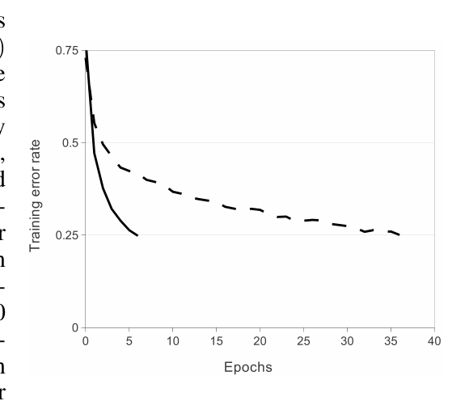
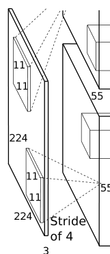
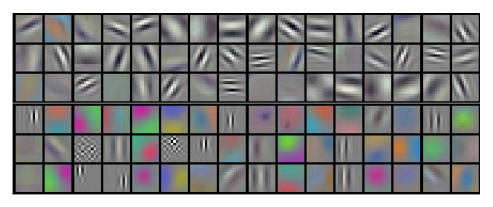
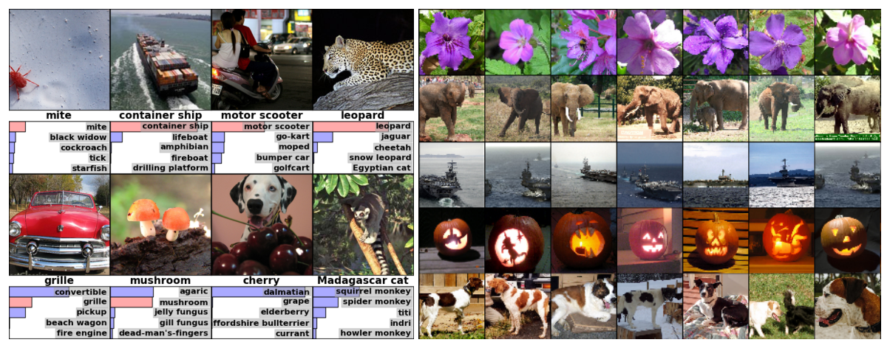

# AlexNet 精读笔记

- 论文：ImageNet Classification with Deep Convolutional Neural Networks. Alex Krizhevsky, Ilya Sutskever, Geoffrey E. Hinton. University of Toronto. NIPS 2012 (2012).
- 对照文本：本目录下 `02_AlexNet_2012.md`（英中段落对齐版）。下文引用先列英文原文、再列中文译文，括号内的行号（英 / 中）均指该文件。
- 阅读顺序：问题 → 人和当时的条件 → 影响 → 方法 → 证据。

**一句话：把一个 8 层、6000 万参数的卷积网络放到 120 万张图上训练，靠 ReLU 和两块 GPU 把训练时间压进一周，靠数据增强和 dropout 压住过拟合，ImageNet 的 top-5 错误率从 26.2% 降到 15.3%。**

---

## 1. 问题

### 1.1 摘要里的四件事

摘要把全文压成四件事：模型有多大、成绩是多少、怎么训得快、怎么不过拟合。

> We trained a large, deep convolutional neural network to classify the 1.2 million high-resolution images in the ImageNet LSVRC-2010 contest into the 1000 different classes. On the test data, we achieved top-1 and top-5 error rates of 37.5% and 17.0% which is considerably better than the previous state-of-the-art. The neural network, which has 60 million parameters and 650,000 neurons, consists of five convolutional layers, some of which are followed by max-pooling layers, and three fully-connected layers with a final 1000-way softmax.
>
> 我们训练了一个大型深度卷积神经网络，把 ImageNet LSVRC-2010 竞赛中的 120 万张高分辨率图像分到 1000 个不同类别。在测试数据上，我们取得了 37.5% 的 top-1 错误率和 17.0% 的 top-5 错误率，明显优于此前的最好结果。该神经网络有 6000 万个参数和 65 万个神经元，由五个卷积层（其中一些层之后接最大池化层）和三个全连接层组成，最后是一个 1000 路 softmax。（L22 / L25）

后半句给出两个手段，一个对付训练时间，一个对付过拟合。全文第 3 节讲前者，第 4 节讲后者，第 5 节是训练配方，第 6 节是成绩。

### 1.2 数据从数万张到百万张，模型要跟上

引言的第一段把问题定在数据规模上。

> To improve their performance, we can collect larger datasets, learn more powerful models, and use better techniques for preventing overfitting. Until recently, datasets of labeled images were relatively small — on the order of tens of thousands of images (e.g., NORB [16], Caltech-101/256 [8, 9], and CIFAR-10/100 [12]). … But objects in realistic settings exhibit considerable variability, so to learn to recognize them it is necessary to use much larger training sets.
>
> 要提高其性能，我们可以收集更大规模的数据集、学习更强的模型，并使用更好的技术来防止过拟合。直到不久以前，带标注的图像数据集还相对较小——大约在数万张图像这一量级（例如 NORB [16]、Caltech-101/256 [8, 9] 以及 CIFAR-10/100 [12]）。……但真实场景中的物体表现出相当大的变异性，因此要学会识别它们，就必须使用大得多的训练集。（L32 / L35）

| 数据集 | 规模（论文原话） | 备注 |
| --- | --- | --- |
| NORB、Caltech-101/256、CIFAR-10/100 | 数万张 | 简单任务用增强就够 |
| MNIST | 最好错误率 <0.3% | 已接近人类 |
| LabelMe | 数十万张，完全分割 | |
| ImageNet 全集 | 超过 1500 万张，22000 多类 | 本文的数据来源 |
| ILSVRC 子集 | 约 120 万训练、50000 验证、150000 测试 | 本文的训练集 |

### 1.3 为什么是 CNN：容量可调，先验正确

> To learn about thousands of objects from millions of images, we need a model with a large learning capacity. However, the immense complexity of the object recognition task means that this problem cannot be specified even by a dataset as large as ImageNet, so our model should also have lots of **prior knowledge** to compensate for all the data we don’t have. Convolutional neural networks (CNNs) constitute one such class of models [16, 11, 13, 18, 15, 22, 26]. Their capacity can be controlled by varying their depth and breadth, and they also make strong and mostly correct assumptions about the nature of images (namely, stationarity of statistics and locality of pixel dependencies). Thus, compared to standard feedforward neural networks with similarly-sized layers, CNNs have much fewer connections and parameters and so they are easier to train, while their theoretically-best performance is likely to be only slightly worse.
>
> 要从数百万张图像中学习成千上万种物体，我们需要一个学习容量很大的模型。然而，目标识别任务极其复杂，即便 ImageNet 这样大的数据集也无法完全规定这个问题，因此我们的模型还应当具备大量**先验知识**，以弥补我们并未拥有的那些数据。卷积神经网络（convolutional neural network, CNN）就是这样一类模型 [16, 11, 13, 18, 15, 22, 26]。其容量可以通过改变深度和宽度来控制，而且它们对图像的性质做了很强、并且大体正确的假设（即统计量的平稳性，以及像素依赖的局部性）。因此，与层规模相近的标准前馈神经网络相比，CNN 的连接和参数少得多，从而更容易训练，而其理论上的最佳性能很可能只会略差一些。（L39 / L42）

两条假设：统计量平稳（同一个滤波器可以在整张图上复用），像素依赖局部（每个神经元只看一个小窗口）。作者认可的代价是"理论最佳略差"，换来参数少、容易训练。稿外：这个"先验换数据"的交易，后来在 ViT（本目录 `33_ViT_2020`）里被反过来做，数据够多时去掉卷积先验反而更好。

### 1.4 卡在哪里：算力

> Despite the attractive qualities of CNNs, and despite the relative efficiency of their local architecture, they have still been **prohibitively expensive** to apply in large scale to high-resolution images. Luckily, current GPUs, paired with a highly-optimized implementation of 2D convolution, are powerful enough to facilitate the training of interestingly-large CNNs, and recent datasets such as ImageNet contain enough labeled examples to train such models without severe overfitting.
>
> 尽管 CNN 具备这些吸引人的性质，尽管其局部结构相对高效，把它们大规模应用于高分辨率图像仍然**昂贵得令人却步**。幸运的是，当前的 GPU 配上高度优化的二维卷积实现，已经强大到足以推动对规模可观的 CNN 的训练，而 ImageNet 等近期数据集也包含足够多的标注样本，可以在不发生严重过拟合的情况下训练这类模型。（L46 / L49）

问题被收成三个条件同时满足：一个有先验的模型（CNN，1980 年代就有），一个够大的数据集（ImageNet，2009 年起），一种够便宜的算力（GPU 加手写卷积）。本文做的是把三者接起来，并处理接上之后暴露的两件事：训练慢和过拟合。

---

## 2. 人和当时的条件

### 2.1 作者

> Alex Krizhevsky, Ilya Sutskever, Geoffrey E. Hinton, University of Toronto
>
> Alex Krizhevsky、Ilya Sutskever、Geoffrey E. Hinton，多伦多大学（L5 / L8）

稿外（来自 Wikipedia、Computer History Museum 博客、多伦多大学 2013 年新闻稿）：

- Krizhevsky 和 Sutskever 当时都是 Hinton 的研究生。Krizhevsky 在 2011 年之前已经写了 `cuda-convnet`，在单块 GPU 上训 CIFAR-10 规模的 CNN；Sutskever 提议把它搬到 ImageNet 上，Krizhevsky 把代码扩成多 GPU 版本。训练用的两块 GTX 580 放在 Krizhevsky 父母家的卧室里。
- Hinton 对分工的概括："Ilya 认为该做，Alex 把它做成了。"
- 三人 2012 年注册 DNNresearch，2013 年 3 月被 Google 收购。
- 本合集里的后续：Sutskever 是 `03_Sequence_to_Sequence_2014` 的第一作者；Hinton 是 `05_Distilling_Knowledge_2015` 的第一作者。dropout 的原始论文 [10] 也是 Hinton 组的，本文是它第一次在大规模任务上的应用。

### 2.2 前人：CNN、ReLU、dropout 都不是本文发明的

论文自己列出了每个零件的来源：

| 零件 | 来源（论文引用） | 本文的贡献 |
| --- | --- | --- |
| CNN | LeCun 等 [16] 及 [11, 13, 18, 15, 22, 26] | 做大到 8 层、6000 万参数 |
| ReLU | Nair 与 Hinton [20] | 证明在大 CNN 上训练快好几倍 |
| 局部归一化 | Jarrett 等 [11] 的对比度归一化 | 改成不减均值的"亮度归一化" |
| 柱状多 GPU 结构 | Cireşan 等 [5] | 两列之间在某些层通信 |
| dropout | Hinton 等 [10] | 用在两个全连接层上 |
| 保标签的数据增强 | [25, 4, 5] | 在 CPU 上现算，不占 GPU |

作者对 Jarrett 等人的区分值得记下：

> However, on this dataset the primary concern is preventing overfitting, so the effect they are observing is different from the accelerated ability to fit the training set which we report when using ReLUs. Faster learning has a great influence on the performance of large models trained on large datasets.
>
> 然而在该数据集上，首要问题是防止过拟合，因此他们所观察到的效应，不同于我们在使用 ReLU 时所报告的、更快拟合训练集的能力。更快的学习对在大规模数据集上训练的大模型的性能有很大影响。（L120 / L123）

在小数据集上，非线性的选择是正则问题；在大数据集上，它是优化速度问题。这句话解释了为什么 ReLU 在 2012 年之前没有显出决定性作用。

### 2.3 硬件：3GB 显存和一周的训练时间

> In the end, the network’s size is limited mainly by the amount of memory available on current GPUs and by the amount of training time that we are willing to tolerate. Our network takes between five and six days to train on two GTX 580 3GB GPUs. All of our experiments suggest that our results can be improved simply by waiting for faster GPUs and bigger datasets to become available.
>
> 最终，网络的规模主要受当前 GPU 上可用的显存量，以及我们愿意承受的训练时间所限制。我们的网络在两块 GTX 580 3GB GPU 上需要五到六天才能训练完成。我们的全部实验都表明，只要等到更快的 GPU 和更大规模的数据集出现，结果就可以得到改善。（L60 / L63）

- 网络规模由显存决定，不是由数据决定：作者明确说 120 万样本足够训一个单卡放不下的网络（3.2 节）。所以模型被切成两半，一半一块卡。
- 最后一句是一个预测：结果随算力和数据单调改善。稿外：这个判断后来被 `13_The_Bitter_Lesson_2019` 当作一般规律，被 `15_Scaling_Laws_2020` 写成公式。
- 稿外：GPU 通用计算的编程模型可追到 `01_Brook_for_GPUs_2004`；本文用的是 NVIDIA CUDA，卷积代码由 Krizhevsky 手写并公开（`cuda-convnet`，论文脚注给出地址）。

### 2.4 数据集与评测协议

> ILSVRC uses a subset of ImageNet with roughly 1000 images in each of 1000 categories. In all, there are roughly 1.2 million training images, 50,000 validation images, and 150,000 testing images.
>
> ILSVRC 使用 ImageNet 的一个子集，在 1000 个类别中每一类大约有 1000 张图像。合计大约有 120 万张训练图像、50000 张验证图像和 150000 张测试图像。（L70 / L73）

读表时要分清两个版本：

| 版本 | 测试集标签 | 论文怎么用 |
| --- | --- | --- |
| ILSVRC-2010 | 公开 | 大部分实验和消融在这上面做，报测试集错误率 |
| ILSVRC-2012 | 不公开 | 只报竞赛提交的测试成绩；其余用验证集，作者称两者相差不超过 0.1% |

预处理只有两步：短边缩放到 256 后裁中央 256×256；每个像素减训练集均值。网络直接吃中心化后的 RGB 值，没有 SIFT 一类的手工特征。

---

## 3. 影响

### 3.1 论文自报的成绩

> To make training faster, we used non-saturating neurons and a very efficient GPU implementation of the convolution operation. To reduce overfitting in the fully-connected layers we employed a recently-developed regularization method called “dropout” that proved to be very effective. We also entered a variant of this model in the ILSVRC-2012 competition and achieved a winning top-5 test error rate of **15.3%**, compared to **26.2%** achieved by the second-best entry.
>
> 为了加快训练，我们使用了非饱和神经元，并对卷积运算做了非常高效的 GPU 实现。为了减轻全连接层的过拟合，我们采用了一种新近提出的正则化方法，称为 “dropout”，事实证明它非常有效。我们还把该模型的一个变体送入 ILSVRC-2012 竞赛，取得了 **15.3%** 的获胜 top-5 测试错误率，而第二名的成绩是 **26.2%**。（L22 / L25）

| 数据集 | 此前最好（他人） | 本文 | top-5 绝对下降 |
| --- | --- | --- | --- |
| ILSVRC-2010 测试集 top-1 / top-5 | 45.7% / 25.7%（SIFT + FVs） | 37.5% / 17.0% | 8.7 个点 |
| ILSVRC-2012 测试集 top-5 | 26.2%（SIFT + FVs） | 15.3%（7 CNNs 集成） | 10.9 个点 |
| ImageNet Fall 2009（10,184 类）top-1 / top-5 | 78.1% / 60.9% | 67.4% / 40.9% | 20.0 个点 |

第二名用的是手工特征加 Fisher 向量再做分类器平均，是 2012 年之前的主流路线。差距 10.9 个点，超过此前几年该路线的累计进步（论文没有报告这个累计值，见表 1 的两代结果：28.2% 到 25.7%）。

### 3.2 作者对"深度"的判断

> Our final network contains five convolutional and three fully-connected layers, and this depth seems to be important: we found that removing any convolutional layer (each of which contains no more than 1% of the model’s parameters) resulted in inferior performance.
>
> 我们最终的网络包含五个卷积层和三个全连接层，这一深度看来很重要：我们发现去掉任意一个卷积层（其中每一层所含参数都不超过模型参数的 1%）都会使性能变差。（L53 / L56）

卷积层的参数占比不到 1%，去掉却掉精度。参数量不是决定因素，层数是。这条观察是后面 VGG、GoogLeNet、ResNet 继续加深的出发点（稿外）。ResNet（本目录 `06_ResNet_2015`）把 AlexNet 记为"8 层"，把它当作深度序列的起点。

### 3.3 稿外：后来真的发生了什么

线上资料（Wikipedia、CHM、CS231n 讲义等），与论文原文无关：

- 引用量：截至 2025 年，Google Scholar 上约 17 万到 20 万次。Yann LeCun 在 ECCV 2012 上称它是"计算机视觉史上一个明确的转折点"。
- ILSVRC 的后续冠军都是 CNN：2013 年 ZFNet（AlexNet 的调参版）、2014 年 GoogLeNet 和 VGG、2015 年 ResNet。top-5 错误率从 15.3% 一路到 3.57%。
- 本文的几个零件成了默认配置：ReLU 成为默认激活函数；dropout 成为全连接层的标准正则；随机裁剪加翻转加颜色扰动成为 ImageNet 训练的固定做法，ResNet 的训练配方明确写"使用 AlexNet 中的标准颜色增强"（本目录 `06_ResNet_2015`）。
- 局部响应归一化是唯一没有留下来的零件，VGG 报告它没有帮助，2015 年后被批归一化取代。
- 两块 GPU 的模型并行是后来大规模并行训练（本目录 `14_ZeRO_2019`、`19_MegaScale_2024`）的最早形态之一。
- 2025 年 CHM 与 Google 合作以 BSD 许可公开了 2012 年原版源码。

---

## 4. 方法

第 3 节按作者自评的重要性排序：ReLU、多 GPU、局部响应归一化、重叠池化，最后是整体结构。第 4 节是两种防过拟合手段。第 5 节是训练细节。下面按同一顺序。

### 4.1 ReLU：训练快好几倍（3.1 节）

> In terms of training time with gradient descent, these saturating nonlinearities are much slower than the non-saturating nonlinearity $f(x) = \max(0, x)$. Following Nair and Hinton [20], we refer to neurons with this nonlinearity as Rectified Linear Units (ReLUs). Deep convolutional neural networks with ReLUs train **several times faster** than their equivalents with tanh units. … This plot shows that we would not have been able to experiment with such large neural networks for this work if we had used traditional saturating neuron models.
>
> 就使用梯度下降时的训练时间而言，这些饱和非线性比非饱和非线性 $f(x) = \max(0, x)$ 慢得多。沿用 Nair 与 Hinton [20] 的说法，我们把采用这一非线性的神经元称为整流线性单元（Rectified Linear Unit, ReLU）。使用 ReLU 的深度卷积神经网络，其训练速度比使用 tanh 单元的对应网络**快好几倍**。……该图表明，如果使用传统的饱和神经元模型，我们就无法在这项工作中试验如此大的神经网络。（L104 / L107）

图 1：CIFAR-10 上一个四层 CNN，ReLU（实线）到达 25% 训练错误率比 tanh（虚线）快六倍；两条曲线的学习率各自调到最快，且都不加正则。

| | tanh / sigmoid | ReLU |
| --- | --- | --- |
| 形式 | $\tanh(x)$、$(1+e^{-x})^{-1}$ | $\max(0, x)$ |
| 饱和 | 两端饱和，梯度趋零 | 正半轴不饱和 |
| 需要输入归一化防饱和 | 需要 | 不需要（3.3 节） |
| 到 25% 训练误差（图 1 读数） | 约 35 个 epoch | 约 6 个 epoch |

作者把 ReLU 的意义定在"让实验成为可能"：训练慢六倍，五六天就变成一个多月，超参数就没法调。

### 4.2 两块 GPU：把网络竖着切开（3.2 节）

> A single GTX 580 GPU has only 3GB of memory, which limits the maximum size of the networks that can be trained on it. It turns out that 1.2 million training examples are enough to train networks which are too big to fit on one GPU. Therefore we spread the net across two GPUs. … The parallelization scheme that we employ essentially puts half of the kernels (or neurons) on each GPU, with one additional trick: **the GPUs communicate only in certain layers.**
>
> 单块 GTX 580 GPU 只有 3GB 显存，这限制了能够在其上训练的网络的最大规模。事实表明，120 万个训练样本足以训练大到一块 GPU 放不下的网络。因此我们把网络分布到两块 GPU 上。……我们所采用的并行方案本质上是把一半的卷积核（或神经元）放在每一块 GPU 上，并另加一个技巧：**GPU 只在某些层进行通信。**（L130 / L133）

- 切法是按卷积核切，每块卡拿一半的特征图。这是模型并行，不是数据并行。
- 第 3 层看第 2 层的全部特征图（跨卡），第 4、5 层只看同一块卡上的特征图（不跨卡）。通信量因此可控。
- 连接模式由交叉验证决定，论文没有报告尝试过的其他模式。

> This scheme reduces our top-1 and top-5 error rates by 1.7% and 1.2%, respectively, as compared with a net with half as many kernels in each convolutional layer trained on one GPU.
>
> 与在一块 GPU 上训练、每个卷积层的卷积核数量减半的网络相比，这一方案把我们的 top-1 和 top-5 错误率分别降低了 1.7% 和 1.2%。（L137 / L140）

作者在脚注里承认这个比较偏向单卡网络：单卡版的最后一个卷积层和全连接层没有减半，所以它比"一半大小"要大。1.7 / 1.2 的收益里，一部分是容量，一部分是双卡结构，论文没有分开。

### 4.3 局部响应归一化（3.3 节）

ReLU 不需要归一化来防饱和，但作者发现下面这个归一化仍有助于泛化。记 $a^i_{x,y}$ 为核 $i$ 在位置 $(x,y)$ 经 ReLU 后的激活：

$$b^{i}_{x,y} = a^{i}_{x,y} \bigg/ \left( k + \alpha \sum_{j=\max(0,\, i-n/2)}^{\min(N-1,\, i+n/2)} \left(a^{j}_{x,y}\right)^{2} \right)^{\beta}$$

求和跑过同一空间位置上 $n$ 个相邻的特征图，$N$ 是该层核的总数。超参数 $k=2$、$n=5$、$\alpha=10^{-4}$、$\beta=0.75$，用验证集定。特征图的顺序是任意的，训练前固定。

> This scheme bears some resemblance to the local contrast normalization scheme of Jarrett et al. [11], but ours would be more correctly termed “brightness normalization”, since we do not subtract the mean activity. Response normalization reduces our top-1 and top-5 error rates by 1.4% and 1.2%, respectively.
>
> 该方案与 Jarrett 等人 [11] 的局部对比度归一化方案有些相似，但我们的方案更恰当地应称为“亮度归一化”，因为我们并不减去平均激活。响应归一化把我们的 top-1 和 top-5 错误率分别降低了 1.4% 和 1.2%。（L165 / L168）

作者的解释是侧抑制：不同核算出的激活为"谁大"竞争。CIFAR-10 上一个四层 CNN 的测试错误率从 13% 到 11%。归一化放在第 1、2 卷积层的 ReLU 之后。

### 4.4 重叠池化（3.4 节）

> If we set $s < z$, we obtain overlapping pooling. This is what we use throughout our network, with $s = 2$ and $z = 3$. This scheme reduces the top-1 and top-5 error rates by 0.4% and 0.3%, respectively, as compared with the non-overlapping scheme $s = 2$, $z = 2$, which produces output of equivalent dimensions. We generally observe during training that models with overlapping pooling find it slightly more difficult to overfit.
>
> 若取 $s < z$，就得到重叠池化。我们在整个网络中使用的就是这种池化，取 $s = 2$、$z = 3$。与产生同等输出维度的非重叠方案 $s = 2$、$z = 2$ 相比，该方案把 top-1 和 top-5 错误率分别降低了 0.4% 和 0.3%。我们在训练中普遍观察到，使用重叠池化的模型稍微更不容易过拟合。（L175 / L178）

$s$ 是池化单元间距，$z$ 是窗口边长。$s=z$ 是传统做法，$s<z$ 窗口重叠。输出尺寸相同，所以这 0.4 / 0.3 只来自重叠本身。"更不容易过拟合"是训练中的观察，论文没有给对应曲线。

### 4.5 整体结构（3.5 节）

> The kernels of the second, fourth, and fifth convolutional layers are connected only to those kernel maps in the previous layer which reside on the same GPU (see Figure 2). The kernels of the third convolutional layer are connected to all kernel maps in the second layer. The neurons in the fully-connected layers are connected to all neurons in the previous layer. Response-normalization layers follow the first and second convolutional layers. Max-pooling layers, of the kind described in Section 3.4, follow both response-normalization layers as well as the fifth convolutional layer. The ReLU non-linearity is applied to the output of every convolutional and fully-connected layer.
>
> 第二、第四和第五个卷积层的卷积核，只连接到前一层中位于同一块 GPU 上的那些特征图（见图 2）。第三个卷积层的卷积核连接到第二层的全部特征图。全连接层中的神经元连接到前一层的全部神经元。响应归一化层接在第一和第二个卷积层之后。第 3.4 节所描述的那种最大池化层，接在两个响应归一化层之后，也接在第五个卷积层之后。ReLU 非线性施加于每一个卷积层和全连接层的输出。（L192 / L195）

图 2 局部（输入端）：224×224×3 的输入被 11×11×3、步长 4 的核过滤，得到 55×55 的特征图，上下两半各在一块 GPU 上。

| 层 | 核 | 输入来源 | 之后接 | 神经元数 |
| --- | --- | --- | --- | --- |
| 输入 | 224×224×3 | | | 150,528 |
| conv1 | 96 个 11×11×3，步长 4 | 全部输入 | LRN，最大池化 | 253,440 |
| conv2 | 256 个 5×5×48 | 同卡 | LRN，最大池化 | 186,624 |
| conv3 | 384 个 3×3×256 | 两卡全部 | 无 | 64,896 |
| conv4 | 384 个 3×3×192 | 同卡 | 无 | 64,896 |
| conv5 | 256 个 3×3×192 | 同卡 | 最大池化 | 43,264 |
| fc6 | 4096 | 全部 | dropout | 4096 |
| fc7 | 4096 | 全部 | dropout | 4096 |
| fc8 | 1000 路 softmax | 全部 | | 1000 |

- 核的第三维暴露了切分：5×5×48、3×3×192 表示只看本卡的一半通道（96/2、384/2），3×3×256 表示看两卡全部。
- 只有三个池化层（conv1、conv2、conv5 之后），conv3 到 conv5 之间没有池化和归一化。
- 目标函数是多项逻辑回归，等价于最大化正确标签的平均对数概率。

### 4.6 过拟合：每个样本只有 10 比特（4 节）

> Our neural network architecture has 60 million parameters. Although the 1000 classes of ILSVRC make each training example impose 10 bits of constraint on the mapping from image to label, this turns out to be insufficient to learn so many parameters without considerable overfitting.
>
> 我们的神经网络结构有 6000 万个参数。尽管 ILSVRC 的 1000 个类别使每个训练样本对从图像到标签的映射施加了 10 比特的约束，这仍不足以在没有明显过拟合的情况下学会这么多参数。（L221 / L224）

$\log_2 1000 \approx 10$ 比特，120 万样本约 1200 万比特的约束，对 6000 万参数不够。两种手段：数据增强扩样本，dropout 减共适应。

**数据增强（4.1 节）。** 两种变换都在 CPU 上用 Python 现算，GPU 同时训上一批，所以"实际上不额外占用计算"，也不落盘。

> We do this by extracting random 224 × 224 patches (and their horizontal reflections) from the 256×256 images and training our network on these extracted patches … This increases the size of our training set by a factor of **2048**, though the resulting training examples are, of course, highly interdependent. Without this scheme, our network suffers from substantial overfitting, which would have forced us to use much smaller networks.
>
> 具体做法是从 256×256 的图像中抽取随机的 224 × 224 图块（及其水平反射），并在这些抽取出的图块上训练我们的网络……这使训练集的规模扩大到原来的 **2048** 倍，当然，由此得到的训练样本高度相互依赖。若没有这一方案，我们的网络会严重过拟合，从而迫使我们使用小得多的网络。（L238 / L241）

$32 \times 32 \times 2 = 2048$：256 减 224 留 32 个平移位置，每维 32，再乘水平翻转。测试时取四角加中心五个 224 块及其翻转，共十块，对 softmax 输出取平均。

第二种是颜色扰动：对训练集全部 RGB 像素做 PCA，对每张图加

$$[p_1, p_2, p_3][\alpha_1 \lambda_1, \alpha_2 \lambda_2, \alpha_3 \lambda_3]^{T}$$

$p_i$、$\lambda_i$ 是 3×3 协方差矩阵的特征向量和特征值，$\alpha_i \sim \mathcal{N}(0, 0.1)$，每张图每次训练抽一次。模拟的是光照强度和颜色变化下物体身份不变。top-1 错误率降低 1% 以上。

**Dropout（4.2 节）。**

> There is, however, a very efficient version of model combination that only costs about a factor of two during training. The recently-introduced technique, called “dropout” [10], consists of setting to zero the output of each hidden neuron with probability 0.5. … This technique reduces complex co-adaptations of neurons, since a neuron cannot rely on the presence of particular other neurons. … At test time, we use all the neurons but multiply their outputs by 0.5, which is a reasonable approximation to taking the geometric mean of the predictive distributions produced by the exponentially-many dropout networks.
>
> 不过，存在一种非常高效的模型组合方式，训练期间的代价大约只是原来的两倍。这种新近提出的技术称为 “dropout” [10]，其做法是以 0.5 的概率把每个隐藏神经元的输出置为零。……该技术减少了神经元之间复杂的共适应，因为一个神经元不能依赖于某些特定的其他神经元一定存在。……测试时，我们使用全部神经元，但把它们的输出乘以 0.5，这是对数量呈指数级的 dropout 网络所产生的预测分布取几何平均的一个合理近似。（L266 / L269）

> We use dropout in the first two fully-connected layers of Figure 2. Without dropout, our network exhibits substantial overfitting. Dropout roughly doubles the number of iterations required to converge.
>
> 我们在图 2 的前两个全连接层中使用 dropout。若没有 dropout，我们的网络会表现出严重的过拟合。Dropout 使收敛所需的迭代次数大约增加一倍。（L273 / L276）

- 作者把 dropout 定位为便宜的模型集成：训多个模型代价太高，dropout 用约两倍的迭代换来指数多个共享权重的子网络。稿外：Hinton 后来在 `05_Distilling_Knowledge_2015` 里从另一个方向处理集成太贵的问题。
- 只用在 fc6、fc7。这两层是参数的主体（脚注说大部分参数在第一个全连接层）。
- 论文没有报告 dropout 单独带来的错误率下降，只说没有它会"严重过拟合"。

### 4.7 训练细节（5 节）

> We trained our models using stochastic gradient descent with a batch size of 128 examples, momentum of 0.9, and weight decay of 0.0005. We found that this small amount of weight decay was important for the model to learn. In other words, weight decay here is **not merely a regularizer**: it reduces the model’s training error.
>
> 我们使用随机梯度下降训练模型，批大小为 128 个样本，动量为 0.9，权重衰减为 0.0005。我们发现，这一很小的权重衰减对模型的学习很重要。换句话说，这里的权重衰减**不仅仅是一个正则项**：它降低了模型的训练误差。（L283 / L286）

$$
\begin{aligned}
v_{i+1} &:= 0.9 \cdot v_i - 0.0005 \cdot \epsilon \cdot w_i - \epsilon \cdot \left\langle \left.\frac{\partial L}{\partial w}\right|_{w_i} \right\rangle_{D_i} \\
w_{i+1} &:= w_i + v_{i+1}
\end{aligned}
$$

> The heuristic which we followed was to divide the learning rate by 10 when the validation error rate stopped improving with the current learning rate. The learning rate was initialized at 0.01 and reduced three times prior to termination. We trained the network for roughly 90 cycles through the training set of 1.2 million images, which took five to six days on two NVIDIA GTX 580 3GB GPUs.
>
> 我们所遵循的启发式规则是：当验证错误率在当前学习率下不再改善时，把学习率除以 10。学习率初始化为 0.01，并在终止之前降低了三次。我们让网络在包含 120 万张图像的训练集上大约循环 90 个周期，这在两块 NVIDIA GTX 580 3GB GPU 上耗时五到六天。（L313 / L316）

| 项 | 取值 |
| --- | --- |
| 优化器 | SGD，batch 128，动量 0.9，权重衰减 0.0005 |
| 学习率 | 全层相同，初始 0.01，验证误差停滞时除以 10，共降三次，手动 |
| 权重初始化 | 零均值高斯，标准差 0.01 |
| 偏置初始化 | conv2、conv4、conv5 和全连接隐藏层为 1，其余为 0 |
| 训练量 | 约 90 个 epoch，两块 GTX 580 3GB，五到六天 |

偏置置 1 是给 ReLU 正输入，让它在训练初期就有梯度。"学习率平台期除以 10"这条经验规则被 ResNet 原样沿用（本目录 `06_ResNet_2015`，稿外对照）。

---

## 5. 证据

实验的顺序：ILSVRC-2010 主结果 → ILSVRC-2012 竞赛 → Fall 2009 大类别版本 → 定性检查（第一层核、top-5 预测、特征检索）。消融散在第 3、4 节，见 5.3。

### 5.1 ILSVRC-2010：与两代手工特征方法比

> Our network achieves top-1 and top-5 test set error rates of 37.5% and 17.0% … The best performance achieved during the ILSVRC-2010 competition was 47.1% and 28.2% with an approach that averages the predictions produced from six sparse-coding models trained on different features [2], and since then the best published results are 45.7% and 25.7% with an approach that averages the predictions of two classifiers trained on Fisher Vectors (FVs) computed from two types of densely-sampled features [24].
>
> 我们的网络在测试集上取得的 top-1 和 top-5 错误率分别为 37.5% 和 17.0%……ILSVRC-2010 竞赛期间取得的最好成绩是 47.1% 和 28.2%，其方法对六个在不同特征上训练的稀疏编码模型所产生的预测取平均 [2]；此后已发表的最好结果是 45.7% 和 25.7%，其方法对两个分类器的预测取平均，这两个分类器训练于由两类稠密采样特征计算出的 Fisher 向量（Fisher Vector, FV）[24]。（L332 / L335）

**表 1**（ILSVRC-2010 测试集，斜体为他人结果）

| 模型 | Top-1 | Top-5 |
| --- | --- | --- |
| *Sparse coding [2]* | *47.1%* | *28.2%* |
| *SIFT + FVs [24]* | *45.7%* | *25.7%* |
| CNN | **37.5%** | **17.0%** |

脚注给出不做十块平均的单次预测成绩：39.0% 和 18.3%。十块平均值 1.5 / 1.3 个点，是测试时的增强，不是模型本身。

两个对手都是多模型平均，本文这一行是单个 CNN。

### 5.2 ILSVRC-2012：单模型、集成、预训练三档

> The CNN described in this paper achieves a top-5 error rate of 18.2%. Averaging the predictions of five similar CNNs gives an error rate of 16.4%. Training one CNN, with an extra sixth convolutional layer over the last pooling layer, to classify the entire ImageNet Fall 2011 release (15M images, 22K categories), and then “fine-tuning” it on ILSVRC-2012 gives an error rate of 16.6%. Averaging the predictions of two CNNs that were pre-trained on the entire Fall 2011 release with the aforementioned five CNNs gives an error rate of 15.3%.
>
> 本文所描述的 CNN 取得 18.2% 的 top-5 错误率。对五个相似 CNN 的预测取平均，错误率为 16.4%。训练一个 CNN，在最后一个池化层之上再增加第六个卷积层，用来对整个 ImageNet 2011 年秋季发布版（15M 张图像、22K 个类别）进行分类，然后在 ILSVRC-2012 上对其“微调”（fine-tuning），错误率为 16.6%。把两个曾在整个 2011 年秋季发布版上预训练的 CNN 的预测，与前述五个 CNN 的预测一起取平均，错误率为 15.3%。（L354 / L357）

**表 2**（ILSVRC-2012，带 * 的在 Fall 2011 全集上预训练）

| 模型 | Top-1 (val) | Top-5 (val) | Top-5 (test) |
| --- | --- | --- | --- |
| *SIFT + FVs [7]* | — | — | *26.2%* |
| 1 CNN | 40.7% | 18.2% | — |
| 5 CNNs | 38.1% | 16.4% | 16.4% |
| 1 CNN* | 39.0% | 16.6% | — |
| 7 CNNs* | 36.7% | 15.4% | **15.3%** |

三个读数：

1. 单个 CNN（18.2%）已经比第二名（26.2%）低 8 个点。集成和预训练合起来再降 2.9 个点。方法有效的证据在第一行，15.3% 是竞赛工程。
2. 在 15M 张图、22K 类上预训练再微调，单模型从 18.2% 到 16.6%。这是论文里"更大数据集能改善结果"的直接证据，也是后来"预训练加微调"范式的一个早期样本（稿外判断）。
3. 5 CNNs 一行验证集和测试集都是 16.4%，支持作者"两者相差不超过 0.1%"的说法。

### 5.3 消融：每个零件值多少

论文没有单独的消融表，数字散在第 3、4 节。汇总（均为错误率的绝对下降，ILSVRC-2010）：

| 零件 | 对照 | top-1 | top-5 | 出处 |
| --- | --- | --- | --- | --- |
| 双 GPU 全宽 | 单 GPU、卷积核减半 | 1.7% | 1.2% | 3.2 节 |
| 局部响应归一化 | 不归一化 | 1.4% | 1.2% | 3.3 节 |
| 重叠池化 $s=2, z=3$ | $s=2, z=2$ | 0.4% | 0.3% | 3.4 节 |
| PCA 颜色扰动 | 不加 | 1% 以上 | 论文没有报告 | 4.1 节 |
| 测试十块平均 | 单块 | 1.5% | 1.3% | 6 节脚注 |
| 去掉任一中间卷积层 | 完整网络 | 约 −2% | 论文没有报告 | 7 节 |
| 随机裁剪加翻转 | 不加 | "严重过拟合"，无数字 | | 4.1 节 |
| dropout | 不加 | "严重过拟合"，无数字 | | 4.2 节 |
| ReLU 对 tanh | 训练速度 | 到 25% 训练误差快六倍（CIFAR-10） | | 图 1 |

- 有数字的项加起来约 6 个点，小于 37.5% 对 45.7% 的 8.2 个点差距。剩下的部分来自 CNN 本身、规模和数据，论文没有拆分。
- 两个最重要的防过拟合手段（增强、dropout）没有数字，只有"严重过拟合"的定性描述。
- 每项消融是否在同一训练配置下独立做的，论文没有说明；这些数字不能简单相加。

### 5.4 深度：去掉哪一层都变差

> Our results show that a large, deep convolutional neural network is capable of achieving record-breaking results on a highly challenging dataset using purely supervised learning. It is notable that our network’s performance degrades if a single convolutional layer is removed. For example, removing any of the middle layers results in a loss of about 2% for the top-1 performance of the network. So the depth really is important for achieving our results.
>
> 我们的结果表明，一个大型的深度卷积神经网络能够仅凭监督学习，就在一个极具挑战性的数据集上取得破纪录的结果。值得注意的是，如果去掉任意一个卷积层，网络的性能就会下降。例如，去掉任何一个中间层，都会使网络的 top-1 性能损失大约 2%。因此，深度对于取得我们的结果确实很重要。（L428 / L431）

"仅凭监督学习"是对当时惯例的一个回应（稿外：2006 到 2011 年间的深层网络多先做无监督预训练）。本文没有用，结果照样成立。去层实验的具体配置（去掉的是哪一层、是否重新调参）论文没有报告。

### 5.5 定性：第一层学到了什么

图 3：第一卷积层的 96 个 11×11×3 核。上 48 个在 GPU 1 上学到，大多是频率和方向选择的灰度边缘；下 48 个在 GPU 2 上，大多是彩色斑块。

> The network has learned a variety of frequency- and orientation-selective kernels, as well as various colored blobs. Notice the specialization exhibited by the two GPUs, a result of the restricted connectivity described in Section 3.5.
>
> 网络学到了多种具有频率选择性和方向选择性的卷积核，以及各种彩色斑块。请注意两块 GPU 所表现出的专门化，这是第 3.5 节所述受限连接的结果。（L388 / L391）

作者说这种分工每次运行都出现，与随机初始化无关（最多两卡编号对调）。两卡在 conv2、conv4、conv5 不通信，所以各自形成一套互不依赖的特征。这是模型并行的一个副作用，论文没有讨论它对精度是好是坏。

### 5.6 定性：top-5 预测和特征空间的近邻

图 4：左，八张测试图和模型的 top-5 标签，红条是正确标签的概率；右，五张测试图（第一列）以及 fc7 特征欧氏距离最近的六张训练图。

> If two images produce feature activation vectors with a small Euclidean separation, we can say that the higher levels of the neural network consider them to be similar. … Notice that at the pixel level, the retrieved training images are generally not close in L2 to the query images in the first column. For example, the retrieved dogs and elephants appear in a variety of poses.
>
> 如果两张图像产生的特征激活向量之间的欧氏距离很小，我们就可以说，神经网络的较高层认为它们是相似的。……请注意，在像素层面上，检索到的训练图像与第一列中的查询图像在 L2 距离上一般并不接近。例如，检索到的狗和大象以各种各样的姿态出现。（L411 / L414）

- 左图：偏离画面中心的螨虫也能识别；豹的其他候选都是猫科；格栅、樱桃两例是照片焦点本身有歧义。
- 右图：像素空间不近、特征空间近，说明 4096 维特征编码的是语义而不是外观。作者顺带提出把这个向量用自编码器压成二进制码做检索，只是一个建议，没有实验。
- 这两幅图是示例，不是统计。八张图和五个查询不构成对泛化能力的度量。

### 5.7 已经证明的和只是猜想的

| 已经证明 | 只是猜想或未量化 |
| --- | --- |
| 单 CNN 在 ILSVRC-2010 上 37.5% / 17.0%，低于两代手工特征方法 | 各零件的收益能否相加 |
| ILSVRC-2012 上单模型 18.2%、集成 15.3%，第二名 26.2% | dropout、随机裁剪各自值多少 |
| ReLU 在 CIFAR-10 四层网络上快六倍 | 大网络上的加速倍数（作者说"随结构变化"） |
| 去掉任一中间卷积层 top-1 掉约 2% | 更深是否继续改善 |
| Fall 2011 预训练再微调，单模型 18.2% 到 16.6% | 无监督预训练会有帮助 |
| 两卡自发形成灰度 / 彩色分工 | 分工对精度的影响 |

---

## 6. 读完留下的五句

1. **三个条件同时满足，CNN 才第一次在大规模任务上赢。** 模型（CNN）和零件（ReLU、dropout）都不是本文的，本文把它们与 ImageNet 和 GPU 接在一起。（引言；2.2 节表）
2. **速度是前提，不是优化项。** ReLU 快六倍、双卡切分、CPU 上现算增强，都是为了把训练压进五六天，让超参数可以调。（图 1；3.1、3.2 节；4.1 节）
3. **过拟合是主要敌人，两种手段都是在造样本。** 随机裁剪加翻转把数据扩 2048 倍；dropout 用两倍迭代换指数多个共享权重的子网络。（4 节）
4. **单模型 18.2% 对 26.2%，这是方法的证据；15.3% 是集成和预训练的竞赛成绩。** 两个数字要分开记。（表 2）
5. **深度重要，但论文只证明"去掉会变差"，没有证明"加上会更好"。** 后一件事留给了 VGG 和 ResNet。（7 节；表 2 里带第六个卷积层的模型同时换了预训练数据，无法单独归因于深度）

## 7. 留给以后的问题（作者自己承认的）

> To simplify our experiments, we did not use any unsupervised pre-training even though we expect that it will help, especially if we obtain enough computational power to significantly increase the size of the network without obtaining a corresponding increase in the amount of labeled data. Thus far, our results have improved as we have made our network larger and trained it longer but we still have many orders of magnitude to go in order to match the infero-temporal pathway of the human visual system. Ultimately we would like to use very large and deep convolutional nets on video sequences where the temporal structure provides very helpful information that is missing or far less obvious in static images.
>
> 为了简化实验，我们没有使用任何无监督预训练，尽管我们预期它会有帮助，尤其是当我们获得足够的计算能力、从而能显著增大网络规模，却没有相应地增加标注数据量的时候。到目前为止，随着我们把网络做得更大、训练得更久，结果一直在改善，但要与人类视觉系统的下颞叶通路相匹配，我们还有许多个数量级的差距。最终，我们希望在视频序列上使用非常大而深的卷积网络，因为时间结构提供了静态图像中所缺失、或者远不那么明显的非常有用的信息。（L435 / L438）

- 无监督预训练是否有帮助：作者预期有，没有做。稿外：ImageNet 分类这条线上，之后几年监督训练一直够用，无监督预训练到 2020 年前后才以对比学习的形式重新有效。
- "更大、更久就更好"到哪里为止：论文只说还差许多个数量级，没有量化。
- 视频：作者的最终目标，本文没有涉及。本合集里 `28_Large_Scale_Video_Classification_2014` 和 `29_Two_Stream_Networks_2014` 是两年后沿这条线的尝试（稿外）。
- 各消融数字能否相加、dropout 和增强各值多少、更深是否更好，论文都没有回答。
